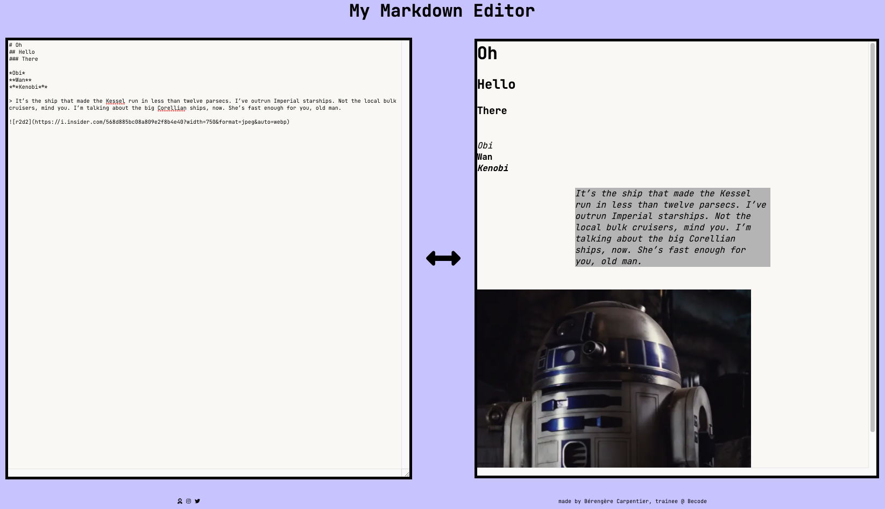

# :seedling: Leaving The Hill - Front End Projects 

made by [**Bérengère Carpentier**](https://github.com/carpentierberengere), trainee @ :office: BeCode.

# What is it about ?
We're ending the Hills portion of our training, and before we start learning about the back-end, we were given 4 challenges to re-enforce our front-end skills.  

## Challenge 3 - The Markdown Editor
A webpage splitted vertically in half. On the left side a **< textarea >** where you can type markdown code, on the right side a preview of the expected result in HTML.

src :arrow_right: [instructions](https://github.com/becodeorg/bxl-hopper-1-25/tree/master/The%20Hill/projects/99.leaving_the_hills)

link to project :arrow_right: click [**HERE**](carpentierberengere.github.io/leaving-the-hill-mdeditor/)  

# Preview

